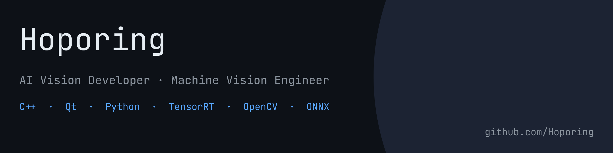

# CompactVLMQt

Qt6 / QML 기반 VLM(Vision Language Model) 영상 분석 Chat 애플리케이션.  
RTSP Stream 또는 Video File의 Frame을 실시간으로 Capture하여 Ollama VLM에 질의하고, 한국어로 번역된 응답을 Chat UI로 표시합니다.

---

## 실행 화면


---

## 주요 기능

- **실시간 RTSP Streaming** — ID / PW 인증 포함, IP Camera 직접 연결
- **Video File 재생** — MP4, AVI, MKV, MOV, WMV, FLV, TS, WEBM 지원
- **정지 이미지 입력** — PNG, JPG, BMP, TIFF, WEBP (대용량 자동 Downscale)
- **Frame Capture** — 현재 Frame을 PNG로 Capture하여 VLM에 전송
- **Multi-turn Chat** — 대화 History를 유지하며 연속 질의 가능
- **한국어 번역** — VLM 응답(영어)을 qwen2.5:3b로 자동 번역
- **Letterbox Rendering** — Landscape / Portrait 비율 자동 유지
- **Dark Theme QML UI** — SplitView, FPS Overlay, 해상도 Badge

---

## 기술 스택

| 분류 | 내용 |
|------|------|
| UI | Qt 6.11 / QML / Qt Quick Controls 2 |
| Language | C++17 |
| Video Decode | libVLC 3.0 (vmem API, D3D11VA Hardware Decode) |
| VLM | Ollama — llama3.2-vision |
| Translation | Ollama — qwen2.5:3b |
| HTTP Client | ollama-hpp (Header-only) |
| Build | CMake 3.20+ / Ninja |

---

## Architecture

```
RTSP / Video File / Image
         │
 VLCFrameGrabber (libvlc vmem)
 ├─ VideoSetup  → I420 Buffer 할당 (긴 변 기준 최대 1920px)
 ├─ VideoLock   → Y / U / V Plane Pointer 제공
 └─ VideoDisplay→ I420 → RGB888 변환 (QImage)
         │
    VideoPlayer
         │
  VideoSurface (QQuickPaintedItem)
  QPainter Letterbox Render
         │
   QML VideoPanel
         │ grabFrameBase64()
      base64 PNG
   ┌────┴────────────────┐
CaptureImageProvider   ChatPanel (QML)
(Thumbnail Preview)         │
                       VLMBridge (QML_ELEMENT)
                            │  QtConcurrent
                       VLMEngine
                       ├─ llama3.2-vision  (Vision Chat)
                       └─ qwen2.5:3b       (EN → KO 번역)
```

**주요 설계 결정**
- `libvlc_video_set_format_callbacks` 사용 — VLC가 Resolution 변경 시마다 Setup Callback을 호출하므로 Buffer Overflow 없이 안전하게 크기 갱신
- 긴 변 기준 1920px Cap — Landscape(3840×2160 → 1920×1080) / Portrait(2160×3840 → 1080×1920) 모두 비율 유지
- `VLMBridge::sendChat` → `QtConcurrent::run` — Ollama 추론 중 UI Thread 블로킹 없음

---

## 요구 사항

- **Qt 6.6+** (MSVC 2022 64-bit)
- **CMake 3.20+** / Ninja
- **libVLC 3.0** — Header: `C:/libVLC/include`, Import Lib: `C:/libVLC/lib`
- **Ollama** — llama3.2-vision, qwen2.5:3b Model Pull 필요

```bash
ollama pull llama3.2-vision
ollama pull qwen2.5:3b
```

---

## 빌드

```bash
cmake -B build -G Ninja -DCMAKE_BUILD_TYPE=Release
cmake --build build --config Release
```

CMake Post-build Step에서 VLC DLL / Plugin 복사 및 `windeployqt6` 실행이 자동으로 수행됩니다.

---

## 사용 방법

1. Ollama 실행
   ```bash
   ollama serve
   ```
2. `CompactVLMQt.exe` 실행 — Ollama 자동 초기화
3. **파일 열기** 또는 RTSP URL 입력 후 **연결** 클릭
4. **Capture** 클릭 → Chat 입력창 위에 Frame Thumbnail 표시
5. 질문 입력 후 **Enter** (또는 **전송**) → llama3.2-vision이 Frame과 함께 분석
6. 정지 이미지는 파일 열기 후 **이미지 전송** 클릭

---

## License

본 프로젝트 코드: **MIT License**  
Qt 라이브러리: **LGPL v3** (동적 링크)  
libVLC: **LGPL v2.1** (동적 링크)
